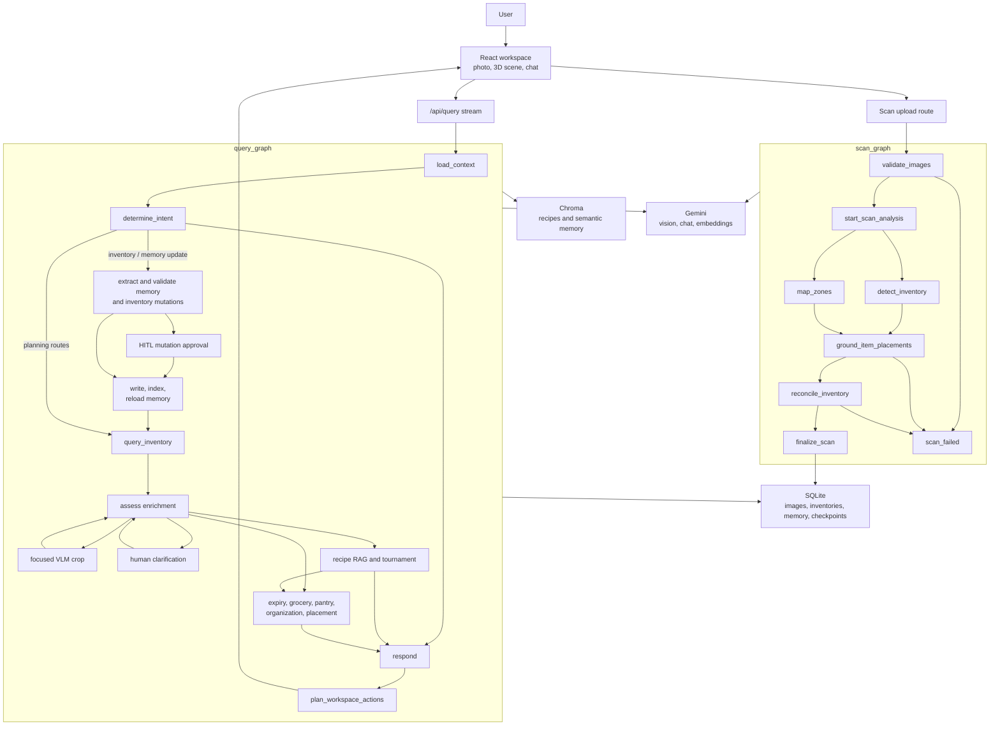

# FridgeFriend
🌽 🥚 🍌 🥩 🧃 🍞 🍒 🍓 🥦 🥬 🍤 🥜

FridgeFriend is an agentic kitchen assistant for grocery shopping, meal planning, and fridge management. It scans a picture of a fridge, freezer, and pantry, makes an inventory displayed in threejs, and lets a user chat with an assistant that knows all about it.

It is based around progressive enrichment: the first scan does not need to understand every item perfectly, but as the user asks questions, corrects items, selects crops, or reviews ambiguous evidence, the system enriches the inventory and memory so the assistant gets more useful over time.

## Quickstart

### Docker

```sh
7z x demo-corpus/prebuilt-data.7z
cp .env.example .env
docker compose up --build
```

Open `http://localhost:3000`.

Set `GOOGLE_API_KEY` in `.env` before starting Compose. Compose starts the app, a local Chroma server, and demo data initialization.

### Dev

Use Node 22.

Initialize .env with a gemini key. Then:

```sh
7z x demo-corpus/prebuilt-data.7z
npm i
npm run chroma
```

In another terminal:

```sh
npm run dev
```

Open the dev server URL printed by React Router. Optional LangSmith tracing and Prompt Hub pulls are enabled when `LANGSMITH_ENDPOINT`, `LANGSMITH_API_KEY`, and `LANGSMITH_PROJECT` are all set.

```sh
npm run test
npm run build
npm run verify
npm run langgraph:dev
```

This repo includes a small slice of the [Kaggle Food.com Dataset](https://www.kaggle.com/datasets/shuyangli94/food-com-recipes-and-user-interactions) for recipes, which we use as a source of truth for recipe generation - thank you to shuyangli94.


## Graph




## Langsmith Evals

You can see some evaluators for query intent (langsmith-query-intent-evaluators.py, langsmith-query-route-contract-evaluators.py)

We also have an example set of fridge images in langsmith-fridge-image-examples.jsonl used to evaluate VLM features in Langsmith.

## Design Notes

### Problem: fridges are hard to scan

Fridges are dark, reflective, crowded, and occluded. Labels may face the wrong way, containers can hide their contents, and leftovers are often visually ambiguous.

### Solution: progressive inventory enrichment

The scan graph validates an image, extracts an inventor, and maps topologies into "zones" (shelves, drawers, etc.). We then ground item placements into a positional list. The query graph can later use a specialized inventory tool to view focused crops, ask the user for clarification, persist corrected evidence, and answer with the enriched inventory instead of pretending the first scan was complete.

This keeps the first scan useful while accepting that some detail only becomes knowable when the user interacts with the assistant - saving latency and tokens.

### Problem: a fridge is not the whole kitchen

A useful kitchen assistant needs freezer, pantry, counter, and cupboard context. It also needs user context: dietary restrictions, preferences, goals, budget, and household inventory outside the scanned fridge image.

### Solution: tiered memory

Long-term memory is structured (most importantly for dietary restrictions) and summarized into query context:

```json
{
  "externalInventory": [
    {
      "name": "rice",
      "storageLocation": "pantry",
      "quantity": { "amount": 1, "unit": "bag", "precision": "estimated" }
    }
  ],
  "dietaryRestrictions": [
    {
      "restrictionType": "allergy",
      "subject": "peanuts",
      "severity": "strict_avoid"
    }
  ],
  "dietaryPreferences": [
    {
      "subject": "spicy food",
      "sentiment": "prefer",
      "strength": 4
    }
  ],
  "activeGoals": [
    {
      "goalType": "budget",
      "description": "keep weekly grocery spend low",
      "priority": 4
    }
  ],
  "semanticMemories": [
    {
      "namespaceType": "user",
      "category": "routine",
      "content": "usually cooks quick dinners on weeknights",
      "confidence": 0.8
    }
  ]
}
```

Conversational memory is short-term, tied to the current UI state:

```json
{
  "selectedItemIds": ["item_1"],
  "selectedZoneIds": ["shelf_2"],
  "selectedRecipeId": null,
  "seededItems": [
    {
      "itemId": "item_1",
      "imageId": "image_1",
      "cropId": "crop_1",
      "userSeeded": true
    }
  ],
  "seededBoundingBoxes": [
    {
      "imageId": "image_1",
      "cropId": "crop_2",
      "boundingBox": { "x": 0.2, "y": 0.3, "width": 0.1, "height": 0.1 },
      "userSeeded": true
    }
  ]
}
```

### Problem: item categories are often too broad

Generic labels like cheese, sauce, greens, or leftovers may be enough for a first answer, but not enough for recipe matching or grocery planning.

### Solution: user and agent enrichment

Users can correct or enrich items directly. The agent can also ask for human review when a validation rule or visual ambiguity requires clarification, without making the graph fail just because the item needs more information.

### Design

The app uses separate scan and query graphs - scan is basically a one-time task, query is an ongoing graph. That said - we do include VLM enrichment in the query graph, so its not a hard line.
The query graph can be thought of as the UX-heavy graph and the scan graph as the VLM-heavy one.
SQLite stores canonical app state and graph checkpoints; Chroma stores recipe and semantic-memory vectors; typed workspace actions keep the agent-to-UI contract explicit.

Recipe search uses RAG plus ranking and tournament evaluation so answers can account for available ingredients, uncertainty, preferences, goals, and missing grocery items rather than simply returning nearest text matches.

The query graph uses a `manage_household_inventory` tool for persistent household inventory outside the active scan: pantry, freezer, and fridge. The tool is tied to the current fridge and supports listing, adding, updating, consuming, and removing items.

Scanned image inventory is separate. The tool only mutates scanned inventory through explicit server-side update paths when a user-approved correction or removal changes the visible inventory.

For intent detection, I settled on a hybrid system, where embeddings are used to classify user intent, and below a certain cosine similarity threshhold, we grab the closest nearby candidate intentions and have the LLM choose one.

## What I could improve on

With more time, I would add depth mapping, image classification and embedding, so the topology model can reason about occlusion and shelf depth instead of only 2D boxes, as well as resolve item classes more consistently.

For a multi-user version, I would add a visual index of the fridge item entries using a visual embedding model such as Nomic or CLIP so the tool can get better at understanding visual content over time.

I would also improve the capture workflow with guided mobile scanning, take advantage of the confidence score more, add household permissions, and richer evaluation datasets for scan accuracy, and recipe/groery planning.